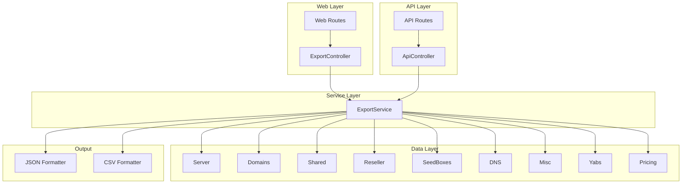

# Design Document: Data Export Feature

## Overview

This design document describes the implementation of data export functionality for My Idlers. The feature enables users to export their service data (servers, domains, shared hosting, reseller hosting, seedboxes, DNS records, and miscellaneous services) in JSON and CSV formats through both web UI and API endpoints.

The implementation follows Laravel conventions and integrates with the existing codebase patterns, including the established API authentication (Bearer token), controller structure, and Blade view components.

## Architecture

The export feature follows a service-oriented architecture with clear separation of concerns:



### Request Flow

1. User initiates export via web UI button or API endpoint
2. Controller validates request (format parameter, authentication for API)
3. Controller calls ExportService with service type and format
4. ExportService fetches data using existing model methods (with relationships)
5. ExportService transforms data to requested format
6. Controller returns response with appropriate headers for download

## Components and Interfaces

### ExportService

The core service class responsible for data transformation and export generation.

```php
<?php

namespace App\Services;

class ExportService
{
    /**
     * Export servers with all related data (YABS, pricing, IPs)
     * @param string $format 'json' or 'csv'
     * @return array{data: string, filename: string, content_type: string}
     */
    public function exportServers(string $format): array;
    
    /**
     * Export domains with pricing data
     * @param string $format 'json' or 'csv'
     * @return array{data: string, filename: string, content_type: string}
     */
    public function exportDomains(string $format): array;
    
    /**
     * Export shared hosting with pricing and IPs
     * @param string $format 'json' or 'csv'
     * @return array{data: string, filename: string, content_type: string}
     */
    public function exportShared(string $format): array;
    
    /**
     * Export reseller hosting with pricing and IPs
     * @param string $format 'json' or 'csv'
     * @return array{data: string, filename: string, content_type: string}
     */
    public function exportReseller(string $format): array;
    
    /**
     * Export seedboxes with pricing
     * @param string $format 'json' or 'csv'
     * @return array{data: string, filename: string, content_type: string}
     */
    public function exportSeedboxes(string $format): array;
    
    /**
     * Export DNS records
     * @param string $format 'json' or 'csv'
     * @return array{data: string, filename: string, content_type: string}
     */
    public function exportDns(string $format): array;
    
    /**
     * Export miscellaneous services with pricing
     * @param string $format 'json' or 'csv'
     * @return array{data: string, filename: string, content_type: string}
     */
    public function exportMisc(string $format): array;
    
    /**
     * Export all data combined
     * @param string $format 'json' or 'csv' (csv returns zip)
     * @return array{data: string, filename: string, content_type: string}
     */
    public function exportAll(string $format): array;
    
    /**
     * Validate export format
     * @param string $format
     * @return bool
     */
    public function isValidFormat(string $format): bool;
    
    /**
     * Transform collection to JSON string
     * @param \Illuminate\Support\Collection $data
     * @return string
     */
    protected function toJson($data): string;
    
    /**
     * Transform collection to CSV string
     * @param \Illuminate\Support\Collection $data
     * @param array $headers
     * @return string
     */
    protected function toCsv($data, array $headers): string;
    
    /**
     * Flatten nested data for CSV export
     * @param array $item
     * @param string $prefix
     * @return array
     */
    protected function flattenForCsv(array $item, string $prefix = ''): array;
}
```

### ExportController

Web controller for handling export downloads from the UI.

```php
<?php

namespace App\Http\Controllers;

class ExportController extends Controller
{
    public function __construct(
        protected ExportService $exportService
    ) {}
    
    /**
     * Export servers data
     * @param Request $request
     * @return \Symfony\Component\HttpFoundation\StreamedResponse
     */
    public function servers(Request $request);
    
    /**
     * Export domains data
     */
    public function domains(Request $request);
    
    /**
     * Export shared hosting data
     */
    public function shared(Request $request);
    
    /**
     * Export reseller hosting data
     */
    public function reseller(Request $request);
    
    /**
     * Export seedboxes data
     */
    public function seedboxes(Request $request);
    
    /**
     * Export DNS records
     */
    public function dns(Request $request);
    
    /**
     * Export misc services data
     */
    public function misc(Request $request);
    
    /**
     * Export all data (global export)
     */
    public function all(Request $request);
}
```

### API Export Methods (in ApiController)

New methods added to the existing ApiController for API-based exports.

```php
// Added to App\Http\Controllers\ApiController

/**
 * API endpoint for exporting servers
 * GET /api/export/servers?format=json|csv
 */
public function exportServers(Request $request);

/**
 * API endpoint for exporting domains
 * GET /api/export/domains?format=json|csv
 */
public function exportDomains(Request $request);

/**
 * API endpoint for exporting shared hosting
 * GET /api/export/shared?format=json|csv
 */
public function exportShared(Request $request);

/**
 * API endpoint for exporting reseller hosting
 * GET /api/export/reseller?format=json|csv
 */
public function exportReseller(Request $request);

/**
 * API endpoint for exporting seedboxes
 * GET /api/export/seedboxes?format=json|csv
 */
public function exportSeedboxes(Request $request);

/**
 * API endpoint for exporting DNS records
 * GET /api/export/dns?format=json|csv
 */
public function exportDns(Request $request);

/**
 * API endpoint for exporting misc services
 * GET /api/export/misc?format=json|csv
 */
public function exportMisc(Request $request);

/**
 * API endpoint for exporting all data
 * GET /api/export/all?format=json|csv
 */
public function exportAll(Request $request);
```

### Routes

**Web Routes (routes/web.php)**
```php
Route::middleware(['auth'])->group(function () {
    Route::get('/export/servers', [ExportController::class, 'servers'])->name('export.servers');
    Route::get('/export/domains', [ExportController::class, 'domains'])->name('export.domains');
    Route::get('/export/shared', [ExportController::class, 'shared'])->name('export.shared');
    Route::get('/export/reseller', [ExportController::class, 'reseller'])->name('export.reseller');
    Route::get('/export/seedboxes', [ExportController::class, 'seedboxes'])->name('export.seedboxes');
    Route::get('/export/dns', [ExportController::class, 'dns'])->name('export.dns');
    Route::get('/export/misc', [ExportController::class, 'misc'])->name('export.misc');
    Route::get('/export/all', [ExportController::class, 'all'])->name('export.all');
});
```

**API Routes (routes/api.php)**
```php
Route::middleware('auth:api')->group(function () {
    Route::get('export/servers', [ApiController::class, 'exportServers']);
    Route::get('export/domains', [ApiController::class, 'exportDomains']);
    Route::get('export/shared', [ApiController::class, 'exportShared']);
    Route::get('export/reseller', [ApiController::class, 'exportReseller']);
    Route::get('export/seedboxes', [ApiController::class, 'exportSeedboxes']);
    Route::get('export/dns', [ApiController::class, 'exportDns']);
    Route::get('export/misc', [ApiController::class, 'exportMisc']);
    Route::get('export/all', [ApiController::class, 'exportAll']);
});
```

## Data Models

### Server Export Structure

```json
{
  "id": "abc12345",
  "hostname": "server1.example.com",
  "server_type": 1,
  "server_type_name": "KVM",
  "cpu": 4,
  "ram": 8,
  "ram_type": "GB",
  "ram_as_mb": 8192,
  "disk": 100,
  "disk_type": "GB",
  "disk_as_gb": 100,
  "bandwidth": 1000,
  "ssh": 22,
  "active": 1,
  "owned_since": "2024-01-15",
  "os": {
    "id": 1,
    "name": "Ubuntu 22.04"
  },
  "location": {
    "id": 1,
    "name": "New York"
  },
  "provider": {
    "id": 1,
    "name": "DigitalOcean"
  },
  "ips": [
    {"address": "192.168.1.1", "is_ipv4": 1}
  ],
  "pricing": {
    "price": 10.00,
    "currency": "USD",
    "term": 1,
    "term_name": "Monthly",
    "as_usd": 10.00,
    "usd_per_month": 10.00,
    "next_due_date": "2024-02-15"
  },
  "yabs": [
    {
      "id": "yabs123",
      "output_date": "2024-01-20 10:30:00",
      "cpu_model": "AMD EPYC 7542",
      "cpu_cores": 4,
      "cpu_freq": 2900,
      "aes": 1,
      "vm": 1,
      "gb5_single": 1200,
      "gb5_multi": 4500,
      "gb6_single": 1500,
      "gb6_multi": 5500,
      "ram": 8,
      "ram_type": "GB",
      "disk": 100,
      "disk_type": "GB",
      "disk_speed": {
        "d_4k": 150,
        "d_4k_type": "MB/s",
        "d_64k": 500,
        "d_64k_type": "MB/s",
        "d_512k": 800,
        "d_512k_type": "MB/s",
        "d_1m": 1000,
        "d_1m_type": "MB/s"
      },
      "network_speed": [
        {
          "location": "NYC",
          "send": 900,
          "send_type": "MBps",
          "receive": 850,
          "receive_type": "MBps"
        }
      ]
    }
  ]
}
```

### Domain Export Structure

```json
{
  "id": "dom12345",
  "domain": "example",
  "extension": "com",
  "full_domain": "example.com",
  "ns1": "ns1.example.com",
  "ns2": "ns2.example.com",
  "ns3": null,
  "owned_since": "2023-06-01",
  "provider": {
    "id": 2,
    "name": "Namecheap"
  },
  "pricing": {
    "price": 12.00,
    "currency": "USD",
    "term": 4,
    "term_name": "Yearly",
    "as_usd": 12.00,
    "usd_per_month": 1.00,
    "next_due_date": "2024-06-01"
  }
}
```

### Shared Hosting Export Structure

```json
{
  "id": "sh12345",
  "main_domain": "mysite.com",
  "shared_type": "cPanel",
  "has_dedicated_ip": 0,
  "disk": 50,
  "disk_type": "GB",
  "bandwidth": 500,
  "domains_limit": 10,
  "subdomains_limit": 50,
  "ftp_limit": 10,
  "email_limit": 100,
  "db_limit": 10,
  "active": 1,
  "owned_since": "2024-01-01",
  "location": {
    "id": 1,
    "name": "New York"
  },
  "provider": {
    "id": 3,
    "name": "SiteGround"
  },
  "ips": [],
  "pricing": {
    "price": 5.99,
    "currency": "USD",
    "term": 1,
    "as_usd": 5.99,
    "usd_per_month": 5.99,
    "next_due_date": "2024-02-01"
  }
}
```

### Reseller Hosting Export Structure

```json
{
  "id": "rs12345",
  "main_domain": "reseller.com",
  "reseller_type": "WHM",
  "accounts": 15,
  "has_dedicated_ip": 1,
  "disk": 200,
  "disk_type": "GB",
  "bandwidth": 2000,
  "domains_limit": 100,
  "subdomains_limit": 500,
  "ftp_limit": 100,
  "email_limit": 1000,
  "db_limit": 100,
  "active": 1,
  "owned_since": "2023-06-01",
  "location": {
    "id": 2,
    "name": "Los Angeles"
  },
  "provider": {
    "id": 4,
    "name": "ResellerClub"
  },
  "ips": [
    {"address": "10.0.0.1", "is_ipv4": 1}
  ],
  "pricing": {
    "price": 29.99,
    "currency": "USD",
    "term": 1,
    "as_usd": 29.99,
    "usd_per_month": 29.99,
    "next_due_date": "2024-02-01"
  }
}
```

### Seedbox Export Structure

```json
{
  "id": "sb12345",
  "title": "My Seedbox",
  "hostname": "seedbox.example.com",
  "seed_box_type": "Dedicated",
  "disk": 2000,
  "disk_type": "GB",
  "bandwidth": 10000,
  "port_speed": 1000,
  "active": 1,
  "owned_since": "2024-01-01",
  "location": {
    "id": 5,
    "name": "Amsterdam"
  },
  "provider": {
    "id": 5,
    "name": "Seedbox.io"
  },
  "pricing": {
    "price": 15.00,
    "currency": "EUR",
    "term": 1,
    "as_usd": 16.50,
    "usd_per_month": 16.50,
    "next_due_date": "2024-02-01"
  }
}
```

### DNS Export Structure

```json
{
  "id": "dns12345",
  "hostname": "mail.example.com",
  "dns_type": "MX",
  "address": "mail.example.com",
  "server_id": null,
  "domain_id": "dom12345"
}
```

### Misc Services Export Structure

```json
{
  "id": "misc12345",
  "name": "SSL Certificate",
  "owned_since": "2024-01-01",
  "pricing": {
    "price": 50.00,
    "currency": "USD",
    "term": 4,
    "as_usd": 50.00,
    "usd_per_month": 4.17,
    "next_due_date": "2025-01-01"
  }
}
```

### Global Export Structure (JSON)

```json
{
  "export_metadata": {
    "export_date": "2024-01-25T10:30:00Z",
    "version": "4.1.0",
    "counts": {
      "servers": 10,
      "domains": 25,
      "shared": 3,
      "reseller": 1,
      "seedboxes": 2,
      "dns": 50,
      "misc": 5
    }
  },
  "servers": [...],
  "domains": [...],
  "shared": [...],
  "reseller": [...],
  "seedboxes": [...],
  "dns": [...],
  "misc": [...]
}
```

### CSV Column Mappings

For CSV exports, nested data is flattened with prefixes:

**Servers CSV Headers:**
```
id,hostname,server_type,server_type_name,cpu,ram,ram_type,disk,disk_type,bandwidth,ssh,active,owned_since,os_id,os_name,location_id,location_name,provider_id,provider_name,ips,pricing_price,pricing_currency,pricing_term,pricing_as_usd,pricing_usd_per_month,pricing_next_due_date,yabs_count,latest_yabs_gb5_single,latest_yabs_gb5_multi,latest_yabs_gb6_single,latest_yabs_gb6_multi
```

**Domains CSV Headers:**
```
id,domain,extension,full_domain,ns1,ns2,ns3,owned_since,provider_id,provider_name,pricing_price,pricing_currency,pricing_term,pricing_as_usd,pricing_usd_per_month,pricing_next_due_date
```


## Correctness Properties

*A property is a characteristic or behavior that should hold true across all valid executions of a system—essentially, a formal statement about what the system should do. Properties serve as the bridge between human-readable specifications and machine-verifiable correctness guarantees.*

Based on the prework analysis, the following properties have been identified after eliminating redundancy:

### Property 1: Service Field Completeness

*For any* service type (servers, domains, shared, reseller, seedboxes, dns, misc) and any valid service record, exporting that service SHALL include all required fields defined for that service type in the output.

**Validates: Requirements 1.1, 2.1, 3.1, 4.1, 5.1, 6.1, 7.1**

### Property 2: Pricing Data Inclusion

*For any* service record that has associated pricing data, the export output SHALL include all pricing fields (price, currency, term, as_usd, usd_per_month, next_due_date).

**Validates: Requirements 1.3, 2.2, 3.2, 4.2, 5.2, 7.2**

### Property 3: IP Address Inclusion

*For any* service record (server, shared, reseller) that has associated IP addresses, the export output SHALL include all IP addresses associated with that service.

**Validates: Requirements 1.4, 3.3, 4.3**

### Property 4: YABS Data Inclusion

*For any* server that has associated YABS benchmark data, the export output SHALL include all YABS records with their disk speed and network speed data.

**Validates: Requirements 1.2**

### Property 5: JSON Output Validity

*For any* export request with JSON format, the output SHALL be valid JSON that can be parsed without errors and SHALL use pretty-print formatting with indentation.

**Validates: Requirements 1.5, 2.3, 8.1, 8.3**

### Property 6: CSV Output Validity

*For any* export request with CSV format, the output SHALL be valid CSV with a header row, proper column escaping for special characters (commas, quotes, newlines), and flattened nested data with appropriate prefixes.

**Validates: Requirements 1.6, 2.4, 8.2, 8.4**

### Property 7: DNS Type Support

*For any* DNS record of any supported type (A, AAAA, DNAME, MX, NS, SOA, TXT, URI), the export SHALL correctly include the record with its type preserved.

**Validates: Requirements 6.2**

### Property 8: Export Response Headers

*For any* export request (web or API), the response SHALL include appropriate Content-Type header (application/json or text/csv) and Content-Disposition header with a descriptive filename.

**Validates: Requirements 9.8, 11.6**

### Property 9: API Authentication Requirement

*For any* API export endpoint, requests without valid Bearer token authentication SHALL be rejected with 401 Unauthorized status.

**Validates: Requirements 11.3**

### Property 10: Global Export JSON Structure

*For any* global export request in JSON format, the output SHALL contain categorized sections for all service types (servers, domains, shared, reseller, seedboxes, dns, misc) and metadata including export_date, version, and service counts.

**Validates: Requirements 10.2, 10.4**

### Property 11: Global Export CSV ZIP Structure

*For any* global export request in CSV format, the output SHALL be a valid ZIP file containing separate CSV files for each service type.

**Validates: Requirements 10.3**

### Property 12: Format Parameter Handling

*For any* export request, the format parameter SHALL accept 'json' or 'csv' values, and invalid format values SHALL result in an error response indicating valid formats.

**Validates: Requirements 8.5, 11.4**

## Error Handling

### Invalid Format Error

When an invalid export format is requested:
- Return HTTP 400 Bad Request
- Response body: `{"error": "Invalid format. Supported formats: json, csv"}`

### Empty Data Export

When exporting a service type with no records:
- Return valid empty structure (empty array for JSON, headers-only for CSV)
- Do not return an error

### Authentication Failure (API)

When API request lacks valid authentication:
- Return HTTP 401 Unauthorized
- Response body: `{"error": "Unauthenticated"}`

### Database/Service Errors

When database or service errors occur:
- Log the error with context
- Return HTTP 500 Internal Server Error
- Response body: `{"error": "Export failed. Please try again."}`

### ZIP Creation Failure (Global CSV Export)

When ZIP file creation fails:
- Log the error
- Return HTTP 500 Internal Server Error
- Response body: `{"error": "Failed to create export archive."}`

## Testing Strategy

### Unit Tests

Unit tests will verify individual components in isolation:

1. **ExportService Tests**
   - Test `toJson()` produces valid JSON
   - Test `toCsv()` produces valid CSV with headers
   - Test `flattenForCsv()` correctly flattens nested structures
   - Test `isValidFormat()` accepts valid formats and rejects invalid ones
   - Test each export method returns correct structure

2. **Data Transformation Tests**
   - Test server data includes all required fields
   - Test YABS data is properly nested
   - Test pricing data is properly included
   - Test IP addresses are properly included
   - Test CSV escaping handles special characters

### Property-Based Tests

Property-based tests will verify universal properties across generated inputs. Each property test MUST run a minimum of 100 iterations.

**Testing Library:** PHPUnit with custom generators (or php-quickcheck if available)

**Property Test Configuration:**
- Minimum iterations: 100
- Each test tagged with: `Feature: data-export, Property {number}: {property_text}`

1. **Property 1 Test: Service Field Completeness**
   - Generate random service records for each type
   - Export and verify all required fields present
   - Tag: `Feature: data-export, Property 1: Service Field Completeness`

2. **Property 2 Test: Pricing Data Inclusion**
   - Generate services with random pricing data
   - Export and verify pricing fields present
   - Tag: `Feature: data-export, Property 2: Pricing Data Inclusion`

3. **Property 3 Test: IP Address Inclusion**
   - Generate services with random IP addresses
   - Export and verify all IPs present
   - Tag: `Feature: data-export, Property 3: IP Address Inclusion`

4. **Property 4 Test: YABS Data Inclusion**
   - Generate servers with random YABS data
   - Export and verify YABS data present with disk/network speeds
   - Tag: `Feature: data-export, Property 4: YABS Data Inclusion`

5. **Property 5 Test: JSON Output Validity**
   - Generate random service data
   - Export as JSON and verify parseable with pretty-print
   - Tag: `Feature: data-export, Property 5: JSON Output Validity`

6. **Property 6 Test: CSV Output Validity**
   - Generate random service data including special characters
   - Export as CSV and verify parseable with proper escaping
   - Tag: `Feature: data-export, Property 6: CSV Output Validity`

7. **Property 7 Test: DNS Type Support**
   - Generate DNS records of each type
   - Export and verify type preserved
   - Tag: `Feature: data-export, Property 7: DNS Type Support`

8. **Property 8 Test: Export Response Headers**
   - Make export requests for each format
   - Verify Content-Type and Content-Disposition headers
   - Tag: `Feature: data-export, Property 8: Export Response Headers`

9. **Property 9 Test: API Authentication Requirement**
   - Make API requests without authentication
   - Verify 401 response
   - Tag: `Feature: data-export, Property 9: API Authentication Requirement`

10. **Property 10 Test: Global Export JSON Structure**
    - Generate data for all service types
    - Export all as JSON and verify structure
    - Tag: `Feature: data-export, Property 10: Global Export JSON Structure`

11. **Property 11 Test: Global Export CSV ZIP Structure**
    - Generate data for all service types
    - Export all as CSV and verify ZIP contents
    - Tag: `Feature: data-export, Property 11: Global Export CSV ZIP Structure`

12. **Property 12 Test: Format Parameter Handling**
    - Test valid formats (json, csv) succeed
    - Test invalid formats return error
    - Tag: `Feature: data-export, Property 12: Format Parameter Handling`

### Integration Tests

Integration tests will verify end-to-end functionality:

1. **Web Export Flow**
   - Test authenticated user can access export routes
   - Test export buttons trigger downloads
   - Test downloaded files have correct content

2. **API Export Flow**
   - Test API endpoints with valid Bearer token
   - Test format parameter handling
   - Test response content-types

3. **Global Export Flow**
   - Test JSON global export contains all service types
   - Test CSV global export produces valid ZIP
   - Test metadata is correctly populated

### Example Tests (Edge Cases)

1. **Empty Export Test**
   - Export when no records exist
   - Verify empty but valid output

2. **Default Format Test**
   - API request without format parameter
   - Verify defaults to JSON

3. **UI Button Presence Tests**
   - Verify export buttons on each index page
   - Verify global export section on settings page
